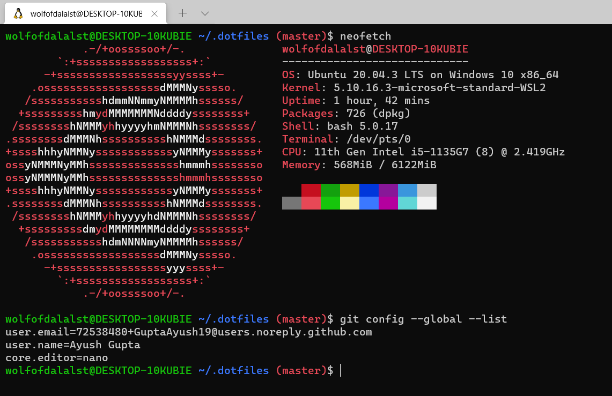

# dotfiles
Neofetch bash output; Ubuntu 20.04 LTS on Windows 10


## Installation
Install Git using APT package manager, which is a prerequisite for the following steps
```
sudo apt-get update
sudo apt-get install git
```
Clone this repository into new hidden directory
```
# Use SSH (if set up) ...
git clone git@github.com:GuptaAyush19/dotfiles.git ~/.dotfiles

# or use HTTPS and switch remotes later.
git clone https://github.com/GuptaAyush19/dotfiles.git ~/.dotfiles
```
Create symlinks in the Home directory to the real files in the repo
```
# There are better and less manual ways to do this;
# investigate install scripts and bootstrapping tools.

ln -s ~/.dotfiles/.bashrc ~/.bashrc
ln -s ~/.dotfiles/.gitconfig ~/.gitconfig
```

## TODOS
* Create an install script for automating this process
* Use brew to install applications